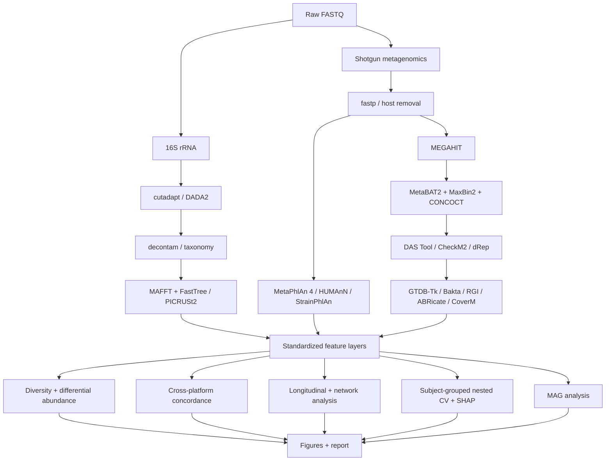
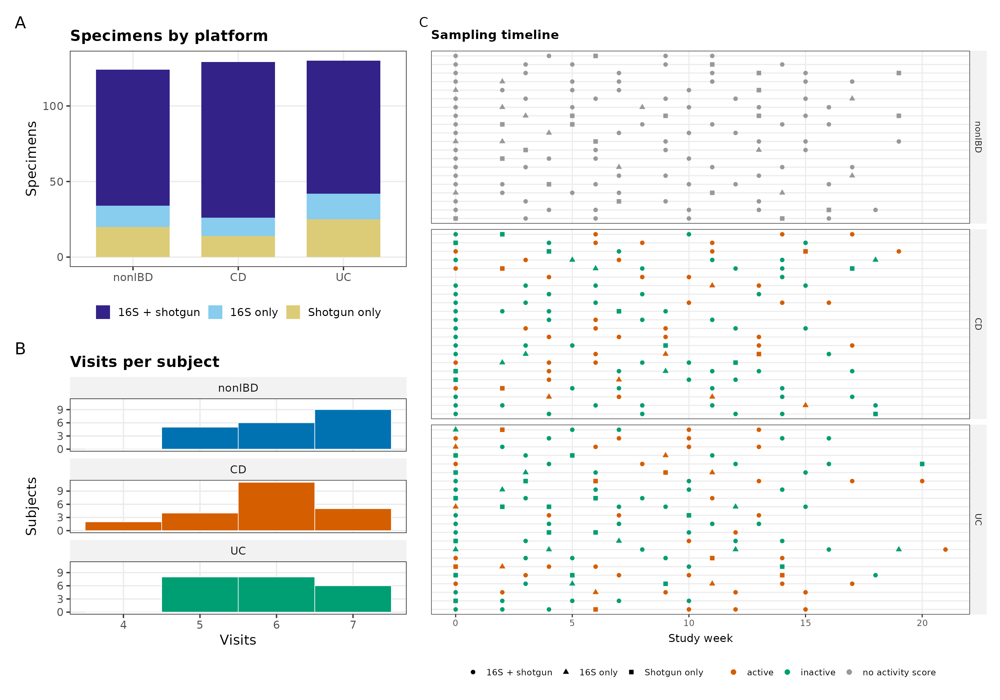
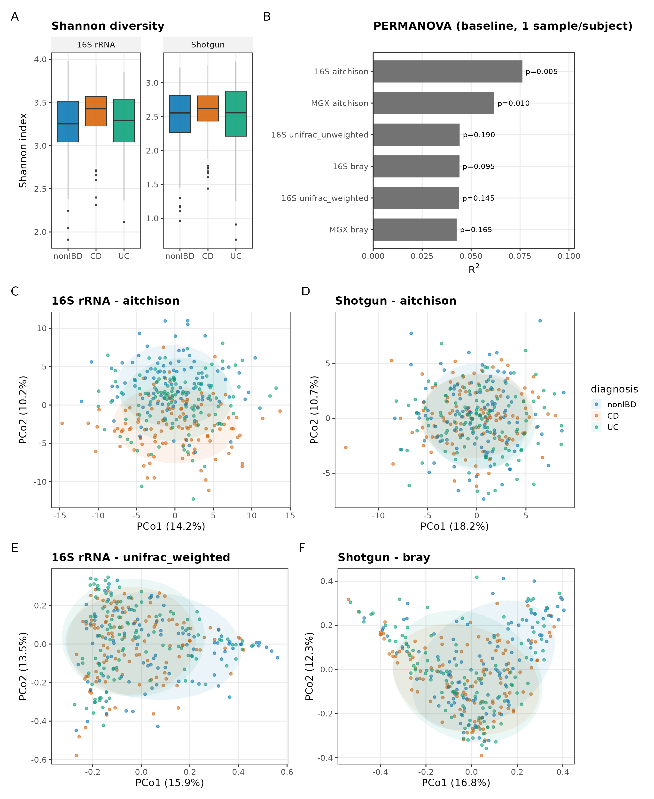
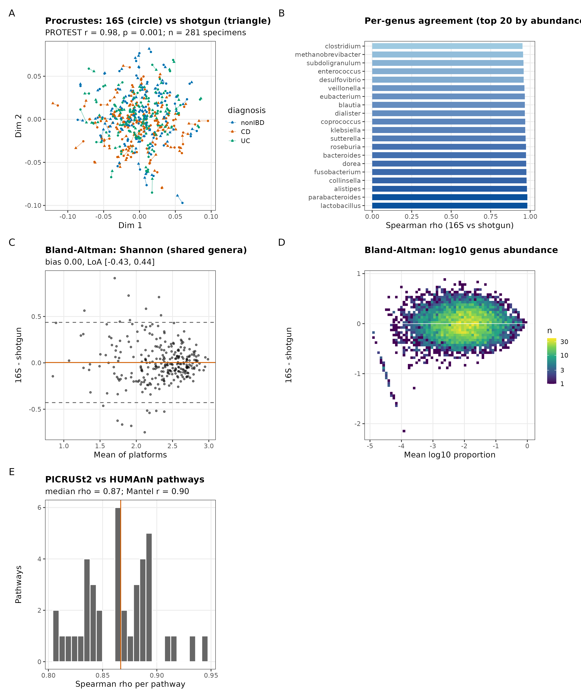
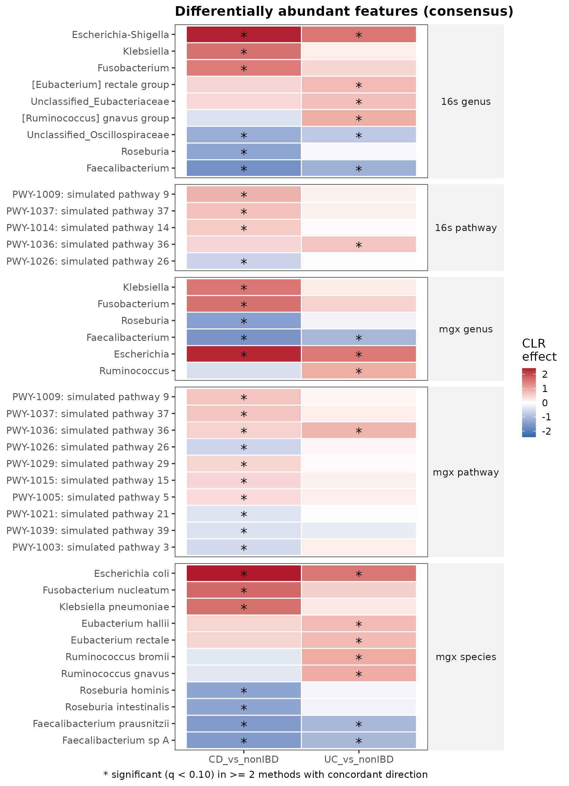
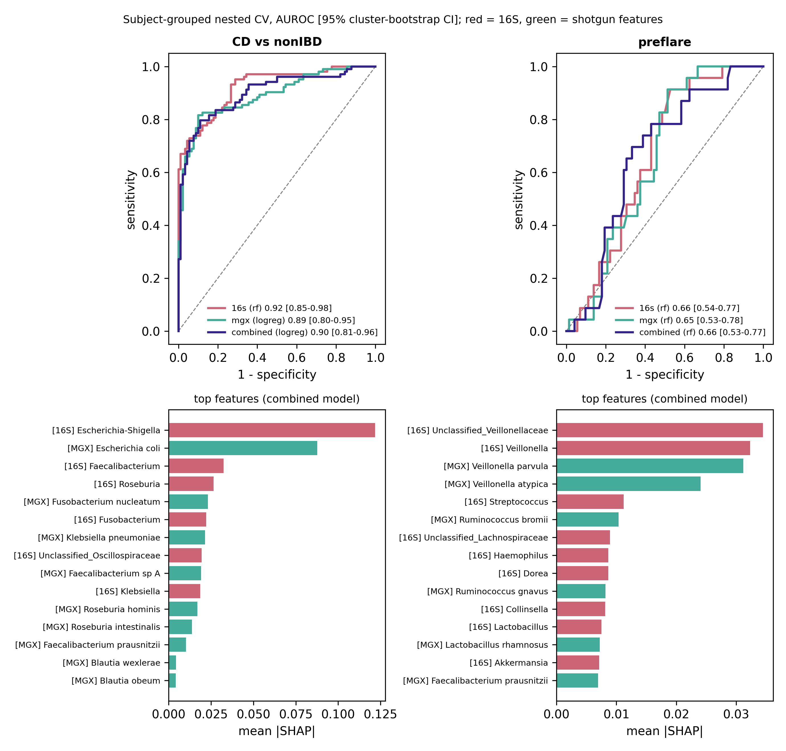
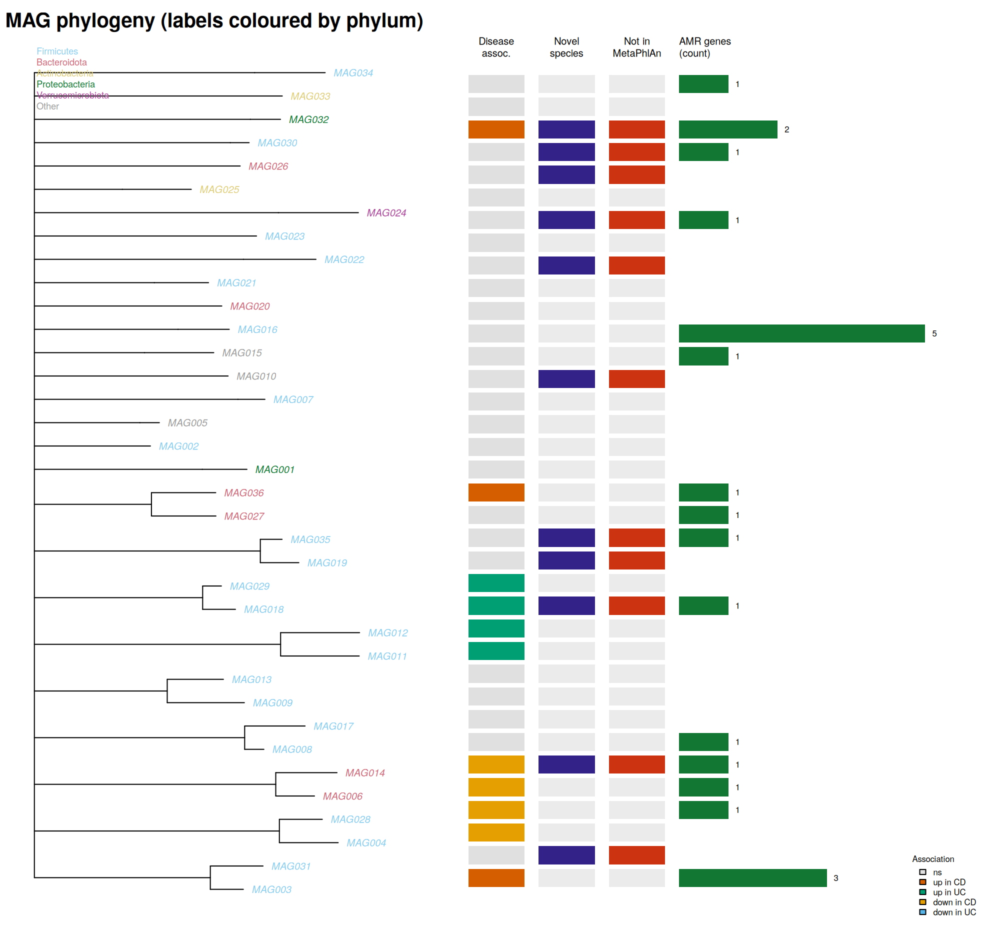

# Cross-platform gut microbiome analysis in IBD: 16S rRNA vs shotgun metagenomics

A reproducible Snakemake workflow that analyses a longitudinal inflammatory-bowel-disease (IBD) cohort with **both** amplicon (16S rRNA) and shotgun metagenomic sequencing, and asks:

1. **Concordance** – how well do 16S taxonomy and PICRUSt2-predicted function agree with shotgun taxonomy (MetaPhlAn 4) and measured function (HUMAnN)?
2. **Signatures** – which taxa, pathways and strains separate Crohn's disease (CD) and ulcerative colitis (UC) from non-IBD controls, track disease activity, and predict an upcoming flare?
3. **Beyond references** – do metagenome-assembled genomes (MAGs) reveal disease-associated, novel (no GTDB species match) or resistance-carrying organisms that reference-based profiling does not report?

The design target is the HMP2/iHMP IBDMDB cohort (BioProject PRJNA398089), but any cohort with a sample sheet in the format of [docs/sample_sheet.md](docs/sample_sheet.md) works.

## What this workflow demonstrates

- **Cross-platform microbiome analysis** – matched 16S rRNA and shotgun metagenomics with standardized feature layers
- **Longitudinal statistics** – repeated-measures modeling, baseline PERMANOVA and flare-aligned trajectories
- **Contamination-aware preprocessing** – negative-control driven `decontam` filtering and batch-aware processing
- **Reference + MAG analysis** – assembly, multi-binner binning, QC, dereplication, GTDB-Tk classification, functional and AMR annotation
- **Leakage-controlled machine learning** – subject-grouped nested cross-validation with training-fold-only compositional preprocessing
- **Model interpretation** – SHAP analysis on refit models, separated from performance estimation
- **Automated validation** – synthetic cohorts with planted biological signals plus truth-recovery/output checks
- **Reproducible execution** – Snakemake, schema-validated configuration, per-rule Conda environments and modular rules

## Project at a glance

| Area | Implementation |
|---|---|
| Workflow engine | Snakemake 8 + modular rules + schema-validated configuration |
| Platforms | 16S rRNA + shotgun metagenomics |
| Core profiling | DADA2, MetaPhlAn 4, HUMAnN, StrainPhlAn |
| MAG pipeline | MEGAHIT, MetaBAT2, MaxBin2, CONCOCT, DAS Tool, CheckM2, dRep, GTDB-Tk |
| Statistics | CLR/Aitchison, mixed models, PERMANOVA, consensus differential abundance, SparCC |
| Machine learning | Subject-grouped nested CV, RF/XGBoost/elastic-net, cluster-bootstrap CIs, SHAP |
| Validation | 16 unit/parser tests + 25 automated truth-recovery/output checks |
| Reproducibility | Conda environments, configurable databases, synthetic end-to-end test |

## Workflow



## Example outputs

The repository includes example figures generated by `make test` from the built-in **synthetic cohort**. These figures demonstrate workflow behavior and planted-signal recovery; **they are not real biological findings**.

### Study design

<p align="center">
  
</p>

### Diversity and community structure

<p align="center">
  
</p>

### Cross-platform concordance

<p align="center">
  
</p>

### Differential-abundance consensus

<p align="center">
  
</p>

### Subject-grouped nested-CV machine learning

<p align="center">
  
</p>

### MAG analysis

<p align="center">
  
</p>

[See all simulated example figures →](docs/example_figures_simulated/)

## Verify the workflow (no external databases needed)

```bash
make unit     # 16 unit/parser tests, seconds
make test     # simulated end-to-end downstream run (~4 min), then 25 truth-recovery/output checks
```

The built-in test suite generates a cohort in the same formats expected from the upstream workflow and plants known signals, including *Escherichia* up and *Faecalibacterium* down in CD, a weak *Veillonella* pre-flare signal, and reagent contaminants in negative controls. `tests/check_results.py` verifies recovery of those signals and validates generated outputs.

The validation run currently checks **25 automated truth-recovery and output-validation checks**, including platform concordance, diversity, PERMANOVA, contamination removal, machine-learning performance, SHAP feature recovery, longitudinal activity signals, MAG annotation and figure generation. See [docs/validation.md](docs/validation.md) for exactly what has and has not been tested.

## Quick start

```bash
# 0. software: Snakemake >= 8 and conda/mamba; every tool is installed per rule from workflow/envs/*.yaml
# 1. databases: follow docs/databases.md, then edit config/config.yaml (databases: block)
# 2. sample sheet (HMP2 helper provided):
python workflow/scripts/build_sample_sheet_hmp2.py --metadata hmp2_metadata.csv --ena ena.tsv --out config/samples.tsv
# 3. check the plan, then run
make dryrun                     # validates the whole DAG
make run CORES=64               # snakemake --use-conda ...
```

Tune before the real run: `amplicon.dada2.trunc_len` (inspect read-quality plots), primers, `assemble = yes` for the subset of shotgun samples to assemble (assembling every sample is rarely affordable), and the activity cut-offs in `design.activity`.

## Outputs (`results/`)

| Figure | Content | Produced by |
|---|---|---|
| `figures/Fig1_study_design` | specimens per platform, visits per subject, sampling timeline with activity | `fig1_design.R` |
| `figures/Fig2_diversity` | Shannon, PERMANOVA R², PCoA (Aitchison, UniFrac, Bray) per platform | `diversity.R` |
| `figures/Fig3_platform_concordance` | Procrustes, per-genus Spearman, Bland–Altman | `concordance.R` |
| `figures/Fig4_differential_abundance` | consensus heatmap across layers and contrasts | `fig_da_heatmap.R` |
| `figures/Fig5_ml_performance` (+ `Fig5_shap_beeswarm_*`) | ROC with cluster-bootstrap CI, top SHAP features | `ml.py` |
| `figures/Fig6_MAG_tree` | MAG phylogeny with disease association, novelty, profiler coverage, AMR | `mag_analysis.R` |
| `figures/Fig7_longitudinal` | feature trajectories aligned to flare onset | `longitudinal.R` |
| `figures/Fig8_cooccurrence_networks` | SparCC networks per diagnosis | `network.py` |
| `figures/Fig9_strain_persistence` | within- vs between-subject strain distances | `strain_analysis.py` |
| `report/summary.md` | key numbers from all analyses | `make_report.py` |

Tables sit next to the figures in `diversity/`, `da/`, `concordance/`, `longitudinal/`, `ml/`, `networks/`, `mags/analysis/`, `strain/`. Per-rule logs are in `logs/`.

## Statistical design (the decisions that matter)

- **Repeated measures.** Subjects contribute many visits. Differential abundance uses mixed models with a subject random intercept (CLR-LMM, MaAsLin2, ANCOM-BC2); ALDEx2 cannot model random effects, so it is run on one baseline sample per subject. All cross-validation is **grouped by subject**.
- **PERMANOVA.** Diagnosis varies *between* subjects, so permuting within subjects (`strata = subject`) cannot test it. Primary tests use one baseline sample per subject with covariates; a sensitivity analysis repeats the test over random one-sample-per-subject draws. Dispersion is checked with `betadisper`.
- **Compositionality.** CLR/Aitchison geometry throughout; no t-tests on relative abundances; no rarefaction (a rarefied alpha-diversity sensitivity check is reported).
- **Consensus.** A feature is called differentially abundant when q < 0.1 in ≥ 2 methods **with the same direction**.
- **Confounders and batch.** age, BMI, sex, antibiotics, immunosuppressants and sequencing batch enter every model; covariates with > 30 % missingness or no variation are dropped *and logged*.
- **Contamination.** `decontam` (prevalence) with negative controls, when present.
- **Machine learning.** Prevalence filtering, pseudocounts and CLR are fitted inside each training fold; tuning happens only in the inner loop; feature sets are compared on the **same specimens**; SHAP is for interpretation of a refit model, not for performance estimation. A label-permutation negative control is provided (`ml_permutation_control`, mean AUROC ≈ 0.5 in our check).
- **Networks.** SparCC with a pooled permutation-null FDR; baseline samples only by default. Treat as exploratory.

Full methods and every deviation from the original plan: [docs/methods.md](docs/methods.md).

## Repository layout

```text
config/      config.yaml (all parameters) · samples.example.tsv · hmp2_columns.yaml · test.config.yaml
workflow/    Snakefile · rules/*.smk · envs/*.yaml · schemas/ · lib/mbstats.py · scripts/ (Python, R/)
tests/       simulate_data.py · test_units.py · test_parsers.py · check_results.py · run_test.sh
docs/        sample_sheet.md · databases.md · methods.md · validation.md
```

## Known limitations

- Binning uses single-sample coverage; multi-sample differential-coverage binning (mapping all visits of a subject) would improve MAGs and is a natural extension.
- The MAG tree uses the bacterial marker set only; archaeal MAGs are catalogued but not drawn.
- HMP2 16S data are mostly mucosal biopsies while shotgun data are stool; the number of paired specimens depends on your metadata release – the cross-platform analyses use the paired subset and report its size.
- Not implemented (listed in the original plan as optional): ConQuR batch correction (batch is modelled as a covariate instead), microbial trajectory clustering, metatranscriptomics, pangenomics, MOFA2/DIABLO multi-omics, time-series flare models. SpiecEasi was replaced by an in-house, unit-tested SparCC.

## Licence

MIT (see `LICENSE`). Tools and databases keep their own licences/terms; see `docs/databases.md`.
